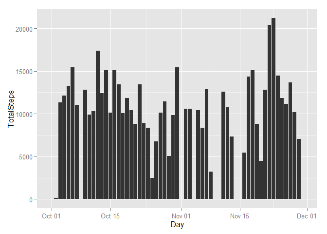
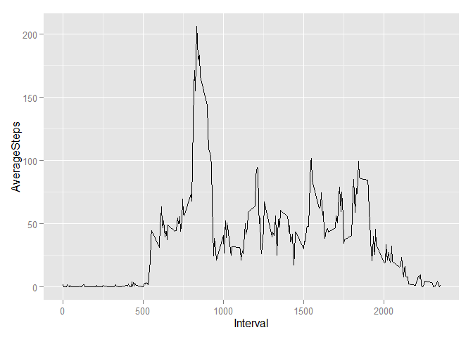
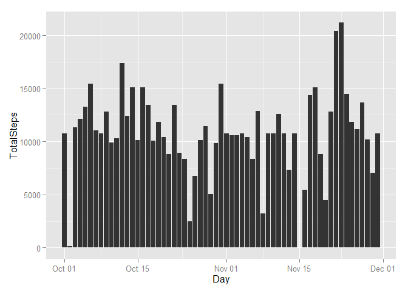
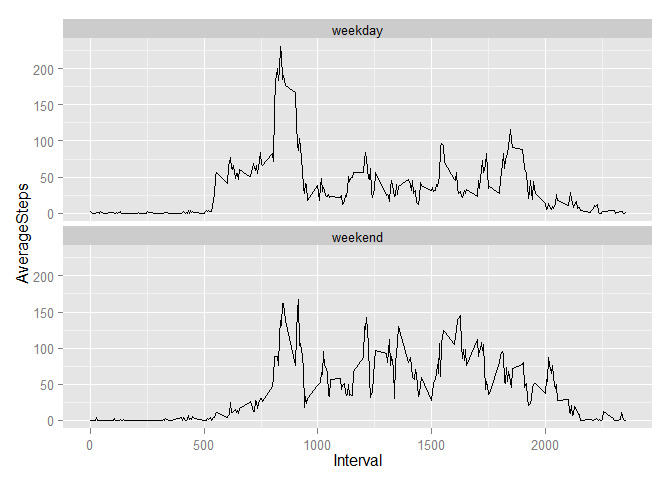

# Reproducible Research: Peer Assessment 1

## Loading and preprocessing the data


```r
library(ggplot2)
#Read Activity file
steps <-read.csv(file.choose())
steps$date <- as.Date(steps$date)
```

## What is mean total number of steps taken per day?

 


## What is the average daily activity pattern?

```r
intervaldata<-aggregate(steps$steps,by=list(steps$interval),FUN=mean, na.rm=TRUE)
#Print Average Steps by Interval
colnames(intervaldata)<-c("Interval","AverageSteps")

b<-qplot(Interval,AverageSteps,data=intervaldata,geom=c("line"))
print(b)
```

 

```r
# Mean of TotalSteps
mean(output$TotalSteps)
```

```
## [1] 9354
```

```r
#Median of Total Steps
median(output$TotalSteps)
```

```
## [1] 10395
```

```r
#Interval when Max Steps was observed
maxinterval<-intervaldata[intervaldata$AverageSteps == max(intervaldata$AverageSteps),1]

maxinterval
```

```
## [1] 835
```

## Imputing missing values
 

## Are there differences in activity patterns between weekdays and weekends?
 

###Interesting project - I am sure there are shorter and more efficient ways to code!!!
